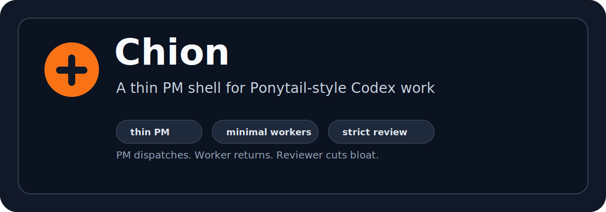

<p align="center">
  
</p>

<p align="center">
  <strong>A thin PM shell for Ponytail-style Codex work.</strong>
</p>

<p align="center">
  <a href="LICENSE"></a>
  
  
</p>

Chion keeps Codex from turning into a chaotic all-in-one worker.

It makes one thread act as a thin PM: explain the business meaning, preserve scope, dispatch bounded workers, require short return packets, and review both correctness and overengineering.

## Why Chion Exists

Long Codex projects drift.

- PM threads start writing code for hours.
- Workers finish work but do not report back clearly.
- Reviewers check "does it run" but miss overengineering.
- Long context makes the assistant forget the user's communication rules.
- Non-technical users get technical noise before business meaning.

Chion turns that into a small operating system:

```text
Chion
├─ PM to user: plain Chinese, objective mentor tone, business first
├─ PM to project: stage, status, risk, next step, user decisions
├─ PM to worker: task id, scope, forbidden areas, validation, return packet
├─ routing gate: pure Q&A / explorer / worker / reviewer / patrol
├─ worker discipline: Ponytail-style minimal reliable changes
└─ reviewer discipline: function check + overengineering check
```

## What It Changes

Without Chion:

```text
User: Fix this project.
Codex: scans everything, writes too much, forgets boundaries, reports a novel.
```

With Chion:

```text
PM: This matters because it protects the release boundary.
PM: W1, inspect only this folder. Use full Ponytail. Return DONE/BLOCKED/NEEDS_PM.
Worker: DONE. Reused existing helper. One-file change. Smoke test passed.
Reviewer: PASS. Lean already. Ship.
```

## Core Behaviors

- Speaks to the user in simplified Chinese, plain language, and an objective mentor tone.
- Explains what the work is useful for before explaining technical actions.
- Keeps the PM thread thin instead of letting it become a worker.
- Runs a routing gate before real work: pure Q&A stays with PM; read-only work routes to explorer; writes route to worker; worker output routes to reviewer.
- Dispatches workers with task ids, explicit scope, no-touch areas, and validation commands.
- Requires worker return statuses: `DONE`, `BLOCKED`, `NEEDS_PM`, or PM marks the task `UNKNOWN`.
- Treats `PM-self-exception` as a narrow fallback, not a normal path. If delegation tools are available, write/generation work should not use it.
- Uses Ponytail-style worker discipline: reuse first, standard library first, native platform first, installed dependencies first, minimal code last.
- Requires bug fixes to target root cause where possible.
- Requires reviewers to check both behavior and complexity.
- Uses `delete`, `stdlib`, `native`, `yagni`, and `shrink` findings for overengineering review.

## Install

Clone or download this repository, then copy the skill folder into your Codex skills directory.

```powershell
Copy-Item -Recurse .\skills\chion $env:USERPROFILE\.codex\skills\chion
```

Restart Codex after installing.

## Verify

Run the repository-level verifier after edits:

```powershell
.\tools\verify-chion.ps1
```

The verifier checks the required Skill files, routing-gate rules, no-silent-completion rules, UI metadata, and the official `quick_validate.py` result when available.

## Use

Invoke it directly:

```text
Use $chion
```

Or use natural triggers:

```text
薄 PM
调度 PM
PM 交接
创建 worker
Reviewer 验收
Patrol 巡查
用大白话汇报项目状态
这个 worker 是不是过度工程了
这个任务派 worker，要求最小可靠改动
```

## Example Worker Dispatch

```text
任务ID：W1
目标：修复 Top5 drawer 备注保存后不刷新的问题。
写入范围：electron_launcher_p6.46.../src
Ponytail 强度：full
验收命令：npm run smoke
回传要求：DONE / BLOCKED / NEEDS_PM，必须带证据路径和验收结果。
```

Expected return:

```text
任务ID：W1
状态：DONE
结果：修复备注保存后列表状态未同步的问题。
证据：src/top5-store.ts；npm run smoke passed
复杂度控制：复用现有 updateRecord；没有新增状态层。
剩余风险：未做端到端 UI 自动化。
需要 PM/用户决定：无。
```

## Example Reviewer Verdict

```text
结论：PASS

功能证据：
- npm run smoke passed
- src/top5-store.ts

Ponytail-review 发现：
- delete:
- stdlib:
- native:
- yagni:
- shrink:
- net: Lean already. Ship.
```

## Repository Layout

```text
.
├── README.md
├── LICENSE
├── assets/
│   └── chion-banner.svg
├── examples/
│   ├── pm-handoff.md
│   ├── reviewer-verdict.md
│   └── worker-dispatch.md
├── tools/
│   └── verify-chion.ps1
└── skills/
    └── chion/
        ├── SKILL.md
        ├── agents/openai.yaml
        └── references/
            ├── templates.md
            └── thin-pm.md
```

## License

MIT
