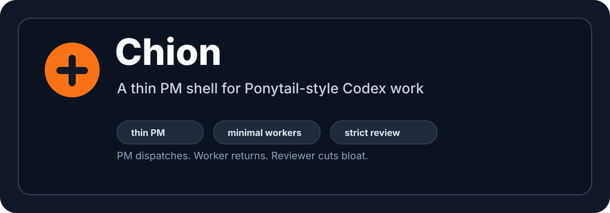

<p align="center">
  
</p>

<h1 align="center">Chion</h1>

<p align="center">
  <strong>You decide what the product should do. Chion works out how to deliver it.</strong>
</p>

<p align="center">
  <a href="LICENSE"></a>
  
  
</p>

Chion is a Codex skill for formal product development. The user owns the product goal; Chion owns the work of finding a safe, minimal path to an independently reviewed result.

Every formal project change uses one PM, one Worker, and one independent read-only Reviewer in three separate threads. No thread may hold two roles.

## Three Roles, One Flow

Formal development runs in separate PM / Worker / read-only Reviewer threads:

| Role | Responsibility | Hard boundary |
| --- | --- | --- |
| PM | Holds the goal, scope, technical decisions, progress, risk, and next step | Does not implement or approve its own work |
| Worker | Traces the real flow, implements one bounded result, and returns evidence | Cannot declare its own result accepted |
| Reviewer | Checks behavior, evidence, boundaries, and unnecessary complexity | Read-only; never edits or directs the Worker |

```text
PM sets the goal and boundaries
  → Worker implements, checks, and returns evidence
  → PM sends the result to the Reviewer
  → Reviewer returns PASS / NEEDS_FIX / FAIL to the PM
  → PM continues, or sends the same Worker a focused repair
```

## Solve Before Escalating

Finding a problem is not the finish line. A technical blocker, failed test, or Reviewer rejection becomes a PM-owned investigation, repair, evidence, or re-review step. It is not handed to the user as an unsolved technical question.

Within the product goal and authorization already agreed by the user, the PM chooses the investigation scope, Worker write scope, technical path, and validation method. Chion asks the user only for real product, business, or authorization decisions.

## Reuse Before Creating

The Worker looks for the first mature solution that covers the current need:

1. the current module and real flow
2. proven code and shared capabilities elsewhere in the project
3. the standard library, native platform features, and installed dependencies
4. current authoritative project or interface documentation
5. only then, the smallest new implementation that works

Ponytail means **minimal and reliable**, not merely fewer lines. Chion still requires necessary safety, data protection, error handling, accessibility, and validation.

## Honest Evidence

A Worker returning `DONE` means “ready for review,” not “accepted.” A Reviewer verdict must say what was proved, what was not proved, the evidence used, and the environment or data level covered.

A static or offline `PASS` proves only that static or offline scope. It does not prove a real data path or production readiness.

Every user update starts with one clear action label, followed by the truthful current state:

```text
【你无需操作】正在推进 / 已完成 / 等待外部条件
【需要你拍板】一个明确的产品、业务或授权决定
```

When a split is useful in a return packet: `PM 内部判断：无；需要用户拍板：无。`

## Long-Task Protection

Chion keeps the active state short: current goal, stage, confirmed result, gap, next step, and any missing return. Detailed history stays behind evidence pointers.

When a thread becomes unclear or too long, the role changes threads at a stage boundary using that short state and the evidence directly needed for the next step. Chion does not claim to detect exactly what context compression removed or to preserve a long conversation without loss; it makes recovery smaller, explicit, and auditable.

## When Chion Runs

- Formal changes to project code, settings, UI, data logic, packages, installers, or project files use the complete three-role flow.
- Pure discussion, explanation, read-only status checks, and harmless actions that do not affect project state stay direct.
- Production actions, external publication, sensitive data, destructive operations, or broader authorization still require explicit user approval.

## Install

Clone or download this repository, then copy the skill into your Codex skills directory:

```powershell
$target = "$env:USERPROFILE\.codex\skills\chion"
New-Item -ItemType Directory -Force $target | Out-Null
Copy-Item -Recurse -Force .\skills\chion\* $target
```

Restart Codex after installing.

## Verify

Run the repository verifier after editing the skill:

```powershell
powershell.exe -NoProfile -ExecutionPolicy Bypass -File .\tools\verify-chion.ps1
```

The verifier checks the required files, three-role boundaries, solve-first and reuse-first rules, user-action labels, references, and UI metadata. It uses the official skill validator when its dependency is available and an equivalent built-in check otherwise.

## Use

Invoke Chion directly:

```text
Use $chion to run this formal development task.
```

Natural requests such as “use a thin PM,” “create a Worker,” “run an independent Reviewer,” or “report the project status in plain language” also match the workflow.

## Example

```text
User: Add export to this product.

PM: 【你无需操作】Checking existing export paths and boundaries.
Worker: DONE. Reused the shared exporter; one bounded change; local check passed.
Reviewer: NEEDS_FIX. The offline error case is not yet proved.
PM: Sends the evidence gap back to the same Worker; the user does not need to solve it.
Worker: DONE. Added the missing check without a new dependency.
Reviewer: PASS for the local offline scope. Real service behavior was not tested.
PM: 【你无需操作】The reviewed offline scope is complete; production readiness is not claimed.
```

## Repository Layout

```text
.
├── README.md
├── LICENSE
├── assets/
│   └── chion-banner.svg
├── examples/
├── tools/
│   └── verify-chion.ps1
└── skills/
    └── chion/
        ├── SKILL.md
        ├── agents/
        │   └── openai.yaml
        └── references/
            ├── templates.md
            └── thin-pm.md
```

## License

MIT
